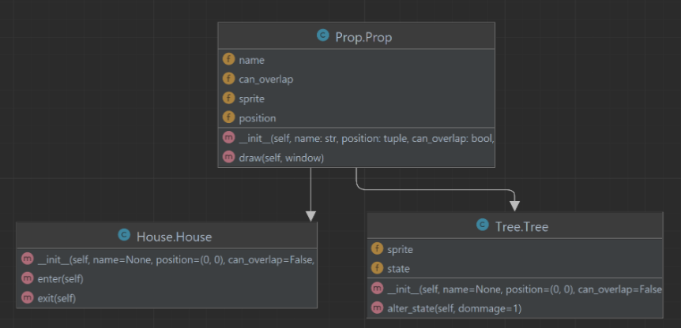
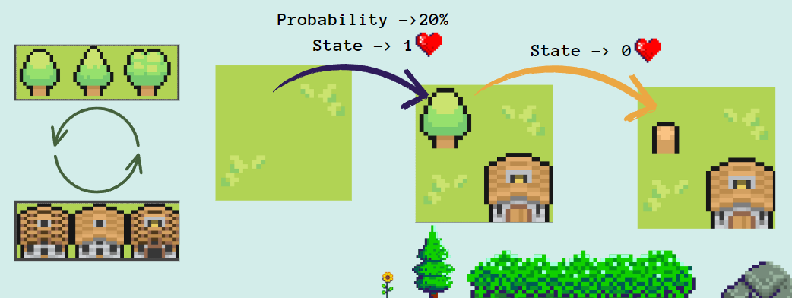

# 2D MAP Wave Fonction Collapse Game

## General presentation 

This project is a 2D map generator in Python3 that utilizes the wave collapse algorithm. It creates a game environment with a player and characters. 

The player can be controlled using direction keys, while the characters move randomly. 

The objective is for the player to avoid getting caught by the characters, as being caught will result in the player being deleted from the map.


## Installation

To run the game, make sure you have Python3 installed on your system. You can install the required libraries by running :

```
 pip install pygame
 pip install bezier
```


## Usage

Run the game by executing the following command:
>> Python3 Controller.py

Once the game is running, you can control the player using the arrow keys. Avoid the characters moving randomly on the map. If the player gets caught by a character, the game ends.

## Gameplay

- Use the arrow keys (up, down, left, right) to move the player.
- Avoid getting caught by the characters moving randomly on the map.
- If the player gets caught by a character, the game ends.
- The objective is to survive as long as possible without getting caught.

## File Structure

- `Controller.py`: Main Python script to run the game.
- `WFC.py`: Contains classes and functions for generating the game map.
- `character.py`: Contains classes for defining the player and characters.
- `Model.py`: Handles the backend tasks.
- `Props.py`,`Tree.py` and `Houses`: Contains classes for defining Trees and houses in the map
- `View.py`: Main Visualization( frontend) of the game.
- `requirements.txt`: Specifies the required libraries for the project.

# Report


## Our objective 

...

## Table of Contents
1. [Land generation](#land-generation)
2. [Added-props](#added-props)
3. [Character](#character)
4. [Database](#database)
5. [What was done finally](#what-was-done-finally)
6. [Conclusion](#conclusion)
7. [Problem encountered - Future improvements](#problem-encountered---future-improvements)

## Division of task

* Map generation : Victor

* Adding Props / Database : Wael

* Character : Prince


## Land generation


## Added-props

To make the game environment more realistic and appealing, we have added decorative elements called "props" to the map generated by the Wave Function Collapse (WFC) algorithm. 

These props are based on the Prop class, which has the following attributes:

- `name`: The name of the prop (optional).

- `position`: The coordinates (x, y) of the prop on the map.

- `can_overlap`: A boolean indicating if the prop can overlap with other objects.

- `sprite`: The file path to the image representing the prop.

These props include trees and houses that are randomly placed during map generation.

The added props aim to make the game environment visually appealing and add extra interaction elements for the player.



### Houses
***
The House class inherits from the Prop class. 

Each instance of House has an additional attribute:

- `state` : The state of the house (present or absent).

Houses are added with a 5% probability on empty tiles of the map, avoiding placement on the location of already generated trees. 

The choice of house sprite is weighted, with a preference for certain variations.


### Trees
***
Trees are represented by the `Tree` class that inherits from the base `Prop` class. 

Tree has an additional attribute:

- `state` : The tree's state, ranging from 0 (cut down) to 4 (intact).

The `alter_state()` method allows for the modification of the tree's state by reducing its "health".

If the state reaches 0, the tree's sprite is replaced with that of a cut-down tree.

Trees are added with a 20% probability on empty tiles of the map generated by the WFC algorithm.

The choice of tree sprite is weighted, with a preference for certain variations to add visual diversity.




## Character
**

## Database
**

## What was done finally
**

## Conclusion 
**

## Problem encountered - Future improvements
**


## Credits

This project was created by Wael,Victor,Prince.

## License

This project is licensed under the [MIT License].
