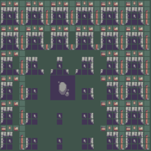
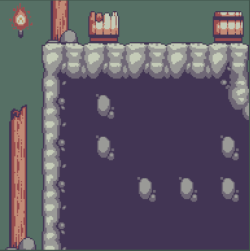
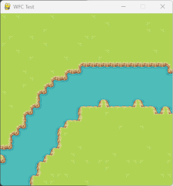
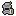

# 2D MAP Wave Fonction Collapse Game

## General presentation 

This project is a 2D map generator in Python3 that utilizes the wave collapse algorithm. It creates a game environment with a player and characters. 

The player can be controlled using direction keys, while the characters move randomly. 

The objective is for the player to avoid getting caught by the characters, as being caught will result in the player being deleted from the map.


## Installation

To run the game, make sure you have Python3 installed on your system. You can install the required libraries by running :

>> pip install -r requirements.txt


## Usage

Run the game by executing the following command:
>> Python3 Controller.py

Once the game is running, you can control the player using the arrow keys. Avoid the characters moving randomly on the map. If the player gets caught by a character, the game ends.

## Gameplay

- Use the arrow keys (up, down, left, right) to move the player.
- Avoid getting caught by the characters moving randomly on the map.
- If the player gets caught by a character, the game ends.
- The objective is to survive as long as possible without getting caught.

## File Structure

- `Controller.py`: Main Python script to run the game.
- `WFC.py`: Contains classes and functions for generating the game map.
- `character.py`: Contains classes for defining the player and characters.
- `Model.py`: Handles the backend tasks.
- `Props.py`,`Tree.py` and `Houses`: Contains classes for defining Trees and houses in the map
- `View.py`: Main Visualization( frontend) of the game.
- `requirements.txt`: Specifies the required libraries for the project.

# Report

## Table of Contents
1. [Land generation](#land-generation)
2. [Added-props](#added-props)
3. [Character](#character)
4. [Database](#database)
5. [Problem encountered - Future improvements](#problem-encountered---future-improvements)
6. [Conclusion](#conclusion)
   
## Division of task

* Map generation : Victor

* Adding Props / Database : Wael

* Character : Prince


## Land generation
To create a map, we generated terrain from different tiles. To have a coherent but random map with a river and roads, we implemented various functions that we will described in this part
### Wave function collapse (WFC)
The wave function collapse is the main algorithm of the land generation. It's this algorithm that tell which tiles is in which position based on its neighbors.

Let's described it more in detail.
#### SuDoKu problem
In Sudoku, each cell in a 9x9 grid can hold a number between 1 and 9, but the rules of the game dictate that each number can only appear once in each row, column, and 3x3 subgrid. 

When you start a puzzle, some cells already have numbers in them. These are the ‘collapsed’ cells, as their value is already determined. The empty cells can be thought of as being in a state of superposition—they could be any number that doesn’t conflict with the existing numbers in the same row, column, or subgrid.


As you deduce the numbers for the empty cells, the superposition collapses, and the possibilities for neighboring cells are affected. You eliminate potential states for the empty cells based on the rules until every cell collapses to a single value, solving the puzzle.

#### Tiles-based
In WFC, a similar concept is applied to more complex sets of data, like tiles in our game map. You start with a grid where each cell can be in any state from a given set. 

Based on the rules or constraints, which can be akin to the Sudoku rules about numbers in rows, columns, and subgrids, you collapse the cells one by one. 

As each cell's state becomes certain, it influences its neighbors, reducing their possible states. The algorithm continues until all cells are collapsed, resulting in a coherent pattern that abides by the given rules.

If we take those tiles in 6x6 grid


As we can see all the grid can be any tiles
Now let's collapse one of the tile



When the tile collapses, its neighbors update and their possibilities are reduced.


When the collapse of one cell reduces the possibilities of the cell in between, that cell collapses. Now, you can repeat these steps.

observation -> propagation -> collapse -> observation -> ...



And if we use our tiles


Randomness makes the map totally chaotic. To remedy this, let's put a weight on the grass tile.


### River

Now let's add a river to our map for that, we use a bezier curve from a side of the map to a other.




We can also make delta


### Roads
To add some life to our map, we add some roads scattered everywhere.


## Added props

To make the game environment more realistic and appealing, we have added decorative elements called "props" to the map generated by the Wave Function Collapse (WFC) algorithm. 

These props are based on the Prop class, which has the following attributes:

- `name`: The name of the prop (optional).

- `position`: The coordinates (x, y) of the prop on the map.

- `can_overlap`: A boolean indicating if the prop can overlap with other objects.

- `sprite`: The file path to the image representing the prop.

These props include trees and houses that are randomly placed during map generation.

The added props aim to make the game environment visually appealing and add extra interaction elements for the player.


### Houses
***
The House class inherits from the Prop class. 

Each instance of House has an additional attribute:

- `state` : The state of the house (present or absent).

Houses are added with a 5% probability on empty tiles of the map, avoiding placement on the location of already generated trees. 

The choice of house sprite is weighted, with a preference for certain variations.


### Trees
***
Trees are represented by the `Tree` class that inherits from the base `Prop` class. 

Tree has an additional attribute:

- `state` : The tree's state, ranging from 0 (cut down) to 4 (intact).

The `alter_state()` method allows for the modification of the tree's state by reducing its "health".

If the state reaches 0, the tree's sprite is replaced with that of a cut-down tree.

Trees are added with a 20% probability on empty tiles of the map generated by the WFC algorithm.

The choice of tree sprite is weighted, with a preference for certain variations to add visual diversity.


## Characters
In this Game we use two types of characters 
- `Character` this is the mother class that can create a moving character in the map

- `Player` this is the controlled character(inherites from character) which is the Player in our game

- `Game` this is a class that handles the modements and combining with the Model of the game

### UML graphs


## Gameplay

- `Use the arrow keys (up, down, left, right)` to move the player.
- Avoid getting caught by the characters moving randomly on the map.
- If the player gets caught by a character, the game ends.
- The objective is to survive as long as possible without getting caught.
  


## Database

Our project uses SQL to store and retrieve data for generated maps. 

__Two tables are created :__

### `Maps`

__This table stores general information about the maps :__

```sql
CREATE TABLE IF NOT EXISTS maps (
    map_id INTEGER PRIMARY KEY AUTOINCREMENT,
    map_name TEXT UNIQUE,
    grid_size INTEGER
)
```

- `map_id`: unique map identifier (auto-incrementing primary key)
- `map_name`: name of the map (must be unique)
- `grid_size`: size of the map grid

### `Lands_layer`

__This table stores tile data for each map :__

```sql
CREATE TABLE IF NOT EXISTS lands_layer (
    id INTEGER PRIMARY KEY AUTOINCREMENT,
    map_id INTEGER,
    rowIndex INTEGER,
    columnIndex INTEGER,
    value INTEGER,
    FOREIGN KEY (map_id) REFERENCES maps(map_id)
)
```

- `id`: unique entry identifier 
- `map_id`: map identifier (foreign key referencing `maps.map_id`)
- `rowIndex`: row index of the tile
- `columnIndex`: column index of the tile
- `value`: value of the tile

__Data insertion into the database is done in two steps :__

1. Insert map information into the `maps` table
2. Insert tile data into the `lands_layer` table with the foreign key of `map_id`

Data retrieval is done by first selecting the `map_id` from the map name, then retrieving the corresponding tiles from `lands_layer`.


## Future Improvements

- Make winning compicated (ex: more character, other moving threats)
- Add more vibe in the map (ex: villages, forests, etc)
- Ability to exceed the limits of the generated Map (extends as the player moves)
  
## Conclusion 


## Credits

This project was created by Wael,Victor,Prince.

## License

This project is licensed under the [MIT License].
